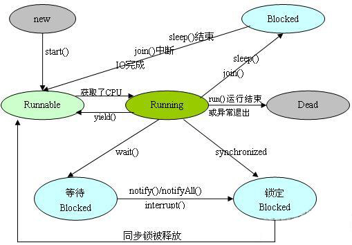

并发编程文档
--
## 一、线程的创建
### 1. 继承 Thread 类
```java 
class extThread extends Thread{
    @Override
    public void run() {
        LogUtil.info("Extend thread running ..");
    }
}

public class TestMain{
      public static void main(String[] args) {
        Thread extThread = new extThread();
        extThread.start();
      }
}
```
### 2. 实现 Runnable 接口
```java
class implThread implements Runnable{
    @Override
    public void run() {
        LogUtil.info("Implement thread running ..");
    }
}

public class TestMain{
      public static void main(String[] args) {
        Thread t2 = new Thread(new implThread());
        t2.start();
      }
}

```
> 两种方式的区别：
>
>  因为线程类继承了 Thread 类，所以不能再继承其他的父类，因此，通过实现 Runnable 接口，可以实现多继承的功能。实现 Runnable 接口的方式来创建线程，比较灵活。

## 二、线程状态
Java JDK 中，线程状态有六种：
* ` NEW`：新建的线程，至今尚未启动的线程处于这种状态
* `RUNNABLE`：就绪状态，一个线程调用 start()方法后，正在 Java 虚拟机中执行的线程处于这种状态，等待 CPU 调度到之后开始执行（Running）
* `BLOCKED`：受阻塞并等待某个监视器锁的线程处于这种状态（如线程中调用 sleep()方法）
* `WAITING`: 无限期地等待另一个线程来执行某一特定操作的线程处于这种状态，当使用 wait() 方法后，线程会进入此状态
* `TIMED_WAITING`: 等待另一个线程来执行取决于指定等待时间的操作的线程处于这种状态，当线程调用 wait(long timeout) 方法后，会进入此状态
* `TERMINATED`:已退出的线程处于这种状态，线程 Dead
> 在给定时间点上，一个线程只能处于一种状态


## 三、线程状态变换

` 如图，状态变换： `



>` 疑问:`
>
>1. 线程状态改变的时候，当 Runnable 状态，调用 join() 后，状态变成 Blocked , 该状态何时会再变得可执行？

## 四、线程同步
### 1.synchronized 同步方法

示例：
```
public synchronized  void add(float amt){
    ...
   }

```
1. 在方法上面添加同步关键字（synchronized），可以防止多个线程调用`同一个实例对象方法（不是同一个对象实例，无法实现同步效果）`的时候产生的数据安全问题。
2. 由于 Java 的每个对象都有一个内置锁，当用此关键字修饰方法时， 内置锁会保护整个方法。在调用该方法前，需要获得内置锁，否则就处于阻塞状态。
> synchronized 关键字也可以修饰静态方法，此时如果调用该静态方法，将会锁住整个类

### 2.synchronized 同步代码块
 *   ##### 代码块
```
 示例：
    synchronized{ 
    }
```
 即有 synchronized 关键字修饰的语句块。 被该关键字修饰的语句块会自动被加上内置锁，从而实现同步。
 
 *  ##### 同步对象的代码块
 
 谁拿到这个锁谁就可以运行它所控制的那段代码。当有一个明确的对象作为锁时，就可以这样写程序
 ```
  示例：
    private byte[] lock = new byte[0]; // 特殊的instance变量，零长度的byte数组对象创建起来将比任何对象都经济
    synchronized(lock){ 
    }
 ```
但当没有明确的对象作为锁，只是想让一段代码同步时，可以创建一个特殊的 instance 变量（它得是一个对象，如上）来充当锁。

### 3.使用特殊域变量(volatile)实现线程同步
> 多线程中的非同步问题主要出现在对域的读写上，如果让域自身避免这个问题，则就不需要修改操作该域的方法
* volatile 关键字为域变量的访问提供了一种免锁机制
* 使用 volatile 修饰域相当于告诉虚拟机该域可能会被其他线程更新
* 每次使用该域就要重新计算，而不是使用寄存器中的值
* volatile `不会提供任何原子操作`，它也不能用来修饰 final 类型的变量 (final 不可改变)

### 4. ThreadLocal 的方式
待完善...

## 五、线程同步与 wait() , notify() , notifyAll()
这三个方法必须在获得同步锁的代码块中使用，否则，会抛出 `IllegalMonitorStateException` 异常。

### 1. wait()
在其他线程调用`此对象的 notify() 方法` 或 `notifyAll()` 方法前，导致当前线程等待。换句话说，此方法的行为就好像它仅执行 wait(0) 调用一样。

> <b>sleep(long timeout) 与 wait(long timeout)的区别:</b>
>
> * sleep(long timeout) ： 指当前线程休眠一段时间，但是并不会释放当前线程所拥有的同步锁。当其他线程执行此对象的同步代码时候，必须要等待该当前线程释放掉同步锁。也就是说，sleep 的时候会一直占用 CPU 资源。
>* wait(long timeout)：当前线程暂停一段时间，在该时间内，当前线程会让出拥有的同步锁，此时，其他线程可以执行该对象的同步代码。

`wait() 方法应始终在循环中使用 :`
```
synchronized (obj) {
    while (<condition does not hold>)
        obj.wait();
        ... // Perform action appropriate to condition
     }
```

### 2. notify()
唤醒在此对象监视器上等待的单个线程。如果所有线程都在此对象上等待，则会选择唤醒其中一个线程。
`此方法只应由作为此对象监视器的所有者的线程来调用`。

### 3. notifyAll()
唤醒在此对象监视器上等待的所有线程。